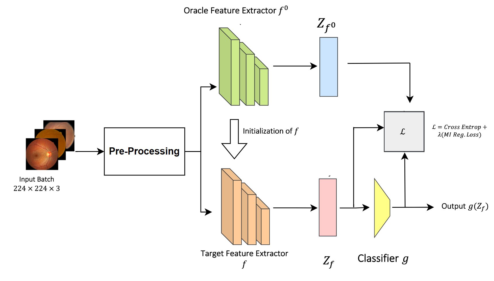

# Domain Generalization in Diabetic Retinopathy
Official Repository for the DART 2023 paper titled DGM-DR: Domain Generalization with Mutual Information Regularized Diabetic Retinopathy Classification. [Link to the logs and the weights of the trained model](https://drive.google.com/drive/folders/1A7OVjSXWGgQzly8PyTyauWMC6Nxyc6Ee)

# Abstract:
Diabetic retinopathy (DR) is a severe condition that can cause vision loss if not promptly and accurately diagnosed. However, detecting DR using machine learning techniques is difficult because of the the variations of scanner vendors, imaging protocols, etc which all create a domain shift [9]. This is where we introduce Domain Generalization which addresses the challenge of building models that can perform well on data from unseen domains. The objective of this project is to apply pre-processing techniques on the following datasets; APTOS, eyePACS, Messidor 1, and Messidor 2 with the goal to improve upon the DGM-DR domain generalization model. This will be achieved by implementing various pre-processing techniques such as CLAHE, sharpening, and rotation. Afterwards, the accuracy of the domain generalization model will be compared between the original and modified datasets to assess the effectiveness of the improvements. The findings of this project is that when applying the mentioned pre-processing techniques, the Aptos dataset improves with all of the different augmentations whilst the rest of the datasets face a decrease in accuracy. 
<p align="center">
    
</p>

The application code we use is based on backbone codes from DomainBed[1], MIRO[2] and SWAD[3].

Install required libraries:
```
pip install -r requirements.txt
```

Run training with Diabetic Retinopathy datasets (have to be organized similarly to PACS):
```
python train_all.py exp_name --dataset DR --data_dir /dataset/path --algorithm MIRO
```

To reproduce the best result from the paper, run the following command:

```
python train_all.py exp_name --dataset DR --data_dir /dataset/path --algorithm MIRO --lr 5e-5 --ld 1.0 --swad True --batch_size 32
```

