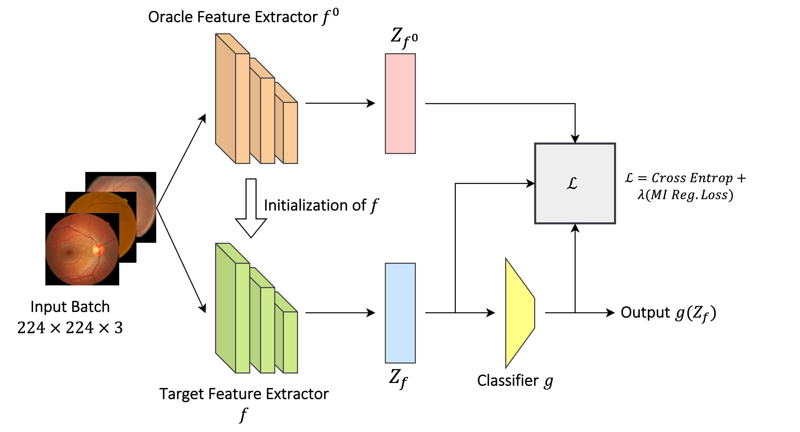

# Domain Generalization in Diabetic Retinopathy
Official Repository for the DART 2023 paper titled DGM-DR: Domain Generalization with Mutual Information Regularized Diabetic Retinopathy Classification. [Link to the logs]([https://arxiv.org/abs/2309.09670](https://drive.google.com/drive/folders/1A7OVjSXWGgQzly8PyTyauWMC6Nxyc6Ee))

# Abstract:
Diabetic retinopathy is a severe condition that can cause vision loss if not promptly
and accurately diagnosed. However, identifying diabetic retinopathy is challeng-
ing due to the complexity and diversity of retinal images across different patients,
which creates a domain shift. To overcome this challenge, we use a machine-
learning technique called Domain Generalization can be used. The objective of
this project is to apply pre-processing techniques on the following datasets; AP-
TOS, Messidor 1, Messidor 2, and eyePACS with the goal to improve upon a
model. This will be achieved by implementing various pre-processing techniques
such as CLAHE, sharpening, normalization, and rotation. Afterwards, the accu-
racy of the domain generalization model will be compared between the original
and modified datasets to assess the effectiveness of the improvements. The find-
ings of this project is that when applying the mentioned pre-processing techniques,
the Aptos dataset improves with all of the different augmentations whilst the rest
of the datasets face a decrease in accuracy which is shown in the result and dis-
cussion section.
<p align="center">
    
</p>

The application code we use is based on backbone codes from DomainBed[1], MIRO[2] and SWAD[3].

Install required libraries:
```
pip install -r requirements.txt
```

Run training with Diabetic Retinopathy datasets (have to be organized similarly to PACS):
```
python train_all.py exp_name --dataset DR --data_dir /dataset/path --algorithm MIRO
```

To reproduce the best result from the paper, run the following command:

```
python train_all.py exp_name --dataset DR --data_dir /dataset/path --algorithm MIRO --lr 5e-5 --ld 1.0 --swad True --batch_size 32
```

The weights of the trained models are available [here](https://drive.google.com/drive/folders/1XPa9UHlCPxAHm-oFw6ey6gLKlWC9er_D?usp=sharing)
